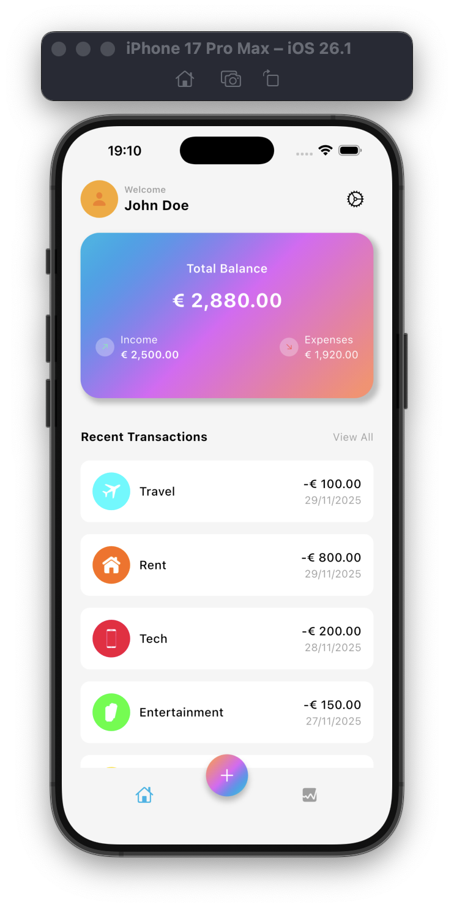
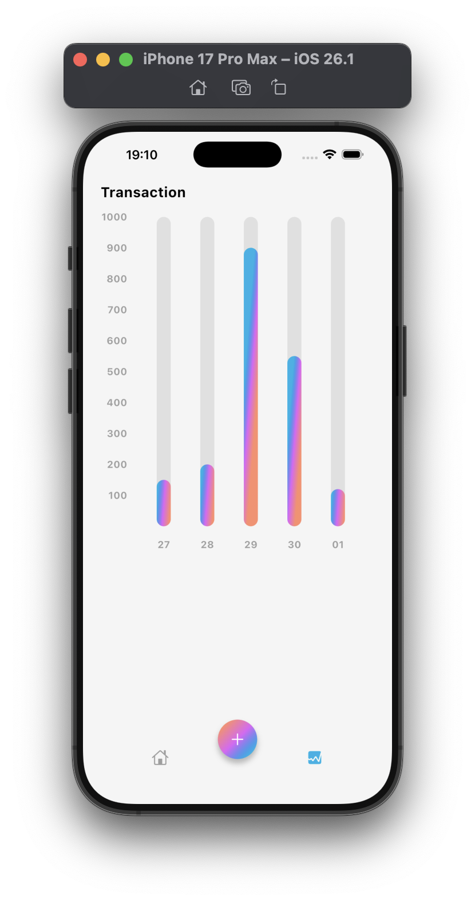
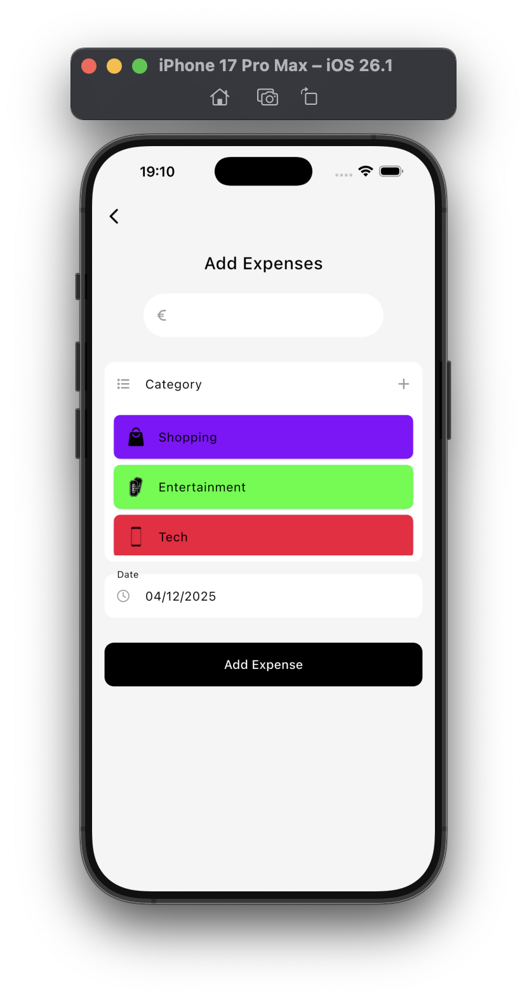

# 💸 Expense Tracker Flutter App

A modern personal finance & expense tracking application built with **Flutter**, using **BLoC architecture**, **Firestore**, and **FL Chart** for visual analytics.

---

## ⭐ Features

- Add / delete / view expenses  
- Category-based expense grouping  
- Dynamic **Total Balance** calculation  
- Static Income + real-time expenses  
- Recent transactions list  
- Gradient wallet-style UI  
- FL Chart bar graph for daily spending  
- Firebase Firestore integration  
- Clean BLoC state management  
- Responsive UI (iOS & Android)

---

## 🧩 Tech Stack

- Flutter  
- Dart  
- Firebase Firestore  
- flutter_bloc  
- equatable  
- fl_chart  
- intl  

---

## 🏗 Architecture

```text
lib/
├─ screens/
│  ├─ home/
│  │  ├─ blocs/
│  │  │  └─ get_expenses_bloc/
│  │  ├─ view/
│  │  │  └─ main_screen.dart
│  ├─ add_expense/
│  │  ├─ blocs/
│  │  ├─ views/
│  ├─ stats/
│  │  ├─ charts.dart
│  │  └─ stats.dart
├─ data/
├─ app.dart
└─ main.dart
```

---

## 📸 Screenshots

| Home | Stats | Add Expense |
|------|--------|-------------|
|  |  |  |

---

## 🗄 Firestore Data Structure

### **Collection: `expenses`**
```text
expenseId: string
title: string
amount: number
category:
  id: string
  name: string
  icon: string
  color: string
date: timestamp
```

### **Collection: `categories`**
```text
categoryId: string
name: string
icon: string
color: string
```

---

## 📊 Charts & Analytics

- Built with **FL Chart**
- € 100 = 1 bar unit
- Displays up to 8 days
- Y-axis: €100, €200, €300 … €1000
- Smooth gradient bars
- Auto-clamped bar heights

---

## ▶️ Running the App

```bash
flutter pub get
flutter run
```

Requires valid Firebase setup and `firebase_options.dart`.

---

## 🔧 Future Improvements

- Monthly summary graphs
- Weekly analytics
- Export to CSV / PDF
- User authentication
- Dark / Light themes
- Multi-currency support

---

## 👤 Author
**Osman Şimşek**  
GitHub: https://github.com/osman0simsek

---

## 📜 License
MIT License
